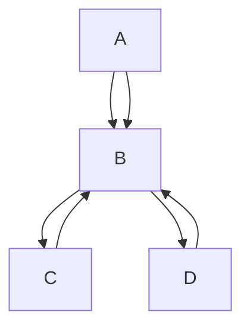

# Temaribet-API

## Overview

This repository hosts the backend for [Temaribet](https://temaribet.net/),a professional tutoring platform based in Addis Ababa, Ethiopia. Temaribet connects parents and students with highly qualified tutors, making personalized learning accessible, efficient, and stress-free for busy parents, ensuring academic success for children.


## Tech Stack

-   **Backend Framework**: [Express.js](https://expressjs.com/)
-   **ORM**: [Prisma](https://www.prisma.io/)
-   **Database**: [MongoDB](https://www.mongodb.com/)
-   **Authentication**: [JSON Web Tokens (JWT)](https://jwt.io/) and [bcrypt](https://www.npmjs.com/package/bcrypt)
-   **File Uploads**: [Multer](https://github.com/expressjs/multer) and [Cloudinary](https://cloudinary.com/)
-   **Environment Variables**: [dotenv](https://github.com/motdotla/dotenv)
-   **Email Services**: [EmailJS](https://www.emailjs.com/)
-   **Development Tools**: [Nodemon](https://nodemon.io/)

---

## Project Structure

```plaintext
├── config/             # Configuration files for the application.
├── lib/                # Library files and utilities.
├── middlewares/        # Middleware functions for request handling.
├── prisma/             # Prisma ORM setup and migrations.
├── routes/             # Route handlers for different endpoints.
├── utils/              # Utility functions and helpers.
├── server.js           # Entry point of the application.
└── README.md           # Documentation.
```

## Architecture Diagram

```plaintext

+-------------------+       +-------------------+       +-------------------+
|                   |       |                   |       |                   |
|   Client (UI)     +------->   Express.js      +------->   MongoDB         |
|                   |       |   (Backend)       |       |   (Database)      |
+-------------------+       +-------------------+       +-------------------+
        ^                        |       ^                       |
        |                        |       |                       |
        |                        v       |                       |
        |                   +-------------------+                |
        |                   |                   |                |
        +-------------------+   Prisma ORM      +<---------------+
                            |                   |
                            +-------------------+


```        

 <!-- 
A[Client (UI)]  
B[Express.js (Backend)]
C[MongoDB (Database)]
D[Prisma ORM] -->



## Setup Instructions

### Prerequisites

-   Install [Node.js](https://nodejs.org/) (v18.x or later recommended).
-   Install [npm](https://www.npmjs.com/).

### Steps

1. **Clone the repository**:

    ```bash
    git clone https://github.com/habasefa/tts-api.git
    ```

2. **Navigate to the project directory**:

    ```bash
    cd tts-api
    ```

3. **Install dependencies**:
    ```bash
    npm install
    ```
4. **Run the development server**:

    ```bash

    npm run dev
    ```

5. **Access the application**:
   The application will be accessible at [http://localhost:3000](http://localhost:3000).
